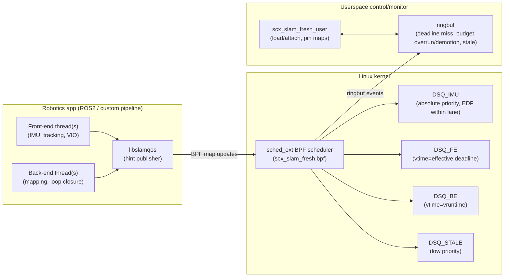

# DESIGN: scx-slam-fresh

## Problem framing
Classical real-time scheduling focuses on meeting deadlines for periodic tasks.
Robotics SLAM pipelines need something slightly different:

1) **Front-end tasks are freshness-critical.**  
   If you track features on an old frame, you can inject bad state.

2) **Back-end tasks are important but elastic.**  
   Loop closure and global optimization can lag.

3) Overload is inevitable on embedded SoCs.  
   The right behavior under overload is not “let everything slow down”, but:
   - keep the control-relevant state estimate current
   - shed/demote stale work
   - cap how much CPU one job can burn

`sched_ext` lets us encode this at the kernel scheduler boundary.

---

## Design goals
- Prioritize *fresh* sensor-derived work over stale work.
- Provide EDF-like behavior for front-end stages.
- Enforce per-job compute budgets with demotion (prevent pipeline collapse).
- Keep a best-effort fairness story for background tasks.
- Provide observability (events, counters) suitable for evaluation writeups.

## Non-goals
- Hard real-time guarantees equivalent to PREEMPT_RT + SCHED_FIFO.
- Vendor-specific or big.LITTLE-specific hacks.
- Per-packet NIC scheduling or GPU scheduling.

---

## Architecture

---

## Data model

### Per-task hint (written by userspace)
Each pipeline thread (or an executor thread pool) periodically publishes:

- **job_id**: monotonically increasing work item identifier
- **release_ts**: when data became ready
- **deadline_ts**: when the output stops being useful (absolute time)
- **stale_ns**: age threshold beyond which we demote the work
- **budget_ns**: compute budget for this job (demote on overrun)
- **slice_ns**: preferred time slice for responsiveness
- **class**: front-end vs back-end

### Per-task state (maintained by BPF)
- `last_start_ns`, `exec_ns_in_job`, `vruntime`
- per-job “already reported” fields to avoid spamming events

---

## DSQ strategy (why 4 queues)
We use 4 custom DSQs:

- DSQ_IMU: dedicated highest-priority lane for IMU propagation, ordered by effective deadline
- DSQ_FE: vtime = effective deadline ⇒ EDF-like ordering  
- DSQ_BE: vtime = vruntime ⇒ CFS-like fairness among BE tasks  
- DSQ_STALE: for tasks past their freshness window (very low priority)

Dispatch order is strict: `DSQ_IMU`, `DSQ_FE`, `DSQ_BE`, then `DSQ_STALE`, with at most one task moved to the CPU-local DSQ per callback. Avoiding local batching preserves lane priority. A waking IMU task is inserted directly at the head of its CPU-local DSQ with `SCX_ENQ_PREEMPT`; otherwise, adding it to a custom DSQ would not shorten the lower-priority task's current slice. Non-wakeup IMU requeues use `DSQ_IMU`. IMU jobs are exempt from stale and already-late demotion so propagation can recover as quickly as possible. Age calculations clamp future release timestamps to zero; this supports periodic producers that arm the next job's hint before its release time.

---

## Failure handling & safety
- We build with partial switch by default, so only `SCHED_EXT` tasks are controlled.
- If the scheduler stalls runnable tasks, or errors occur, the kernel can abort the BPF scheduler and revert tasks to CFS.

---

## Integration with real robots
The demo uses a synthetic pipeline, but the integration model maps cleanly to:
- ROS2 executors (per-callback-group threads)
- custom pipelines with lock-free queues
- sensor fusion / VIO with periodic IMU and camera updates

The only required integration is publishing hints (a small library call) at job start.

## Wake-safe hinting

A subtle but critical detail: `sched_ext` policy decisions are made at **enqueue time** (wake-up).
In a message-driven pipeline (condvars/queues), a consumer thread is enqueued *before* it can pop
a message and publish metadata about that message.

If the consumer publishes its hint only after it begins running, the wake-up has already been
misclassified (often as best-effort), and under overload the thread may never catch up.

**Solution in this project:** combine producer and consumer publication:
1. each worker registers its `pid_tgid` (tgid<<32 | tid)
2. each queue knows its consumer `pid_tgid` and StageCfg
3. when the consumer is sleeping, `push()` writes the head item's hint before waking it
4. after `pop()`, the consumer republishes the exact FIFO item it is about to process

Publishing every pushed item is incorrect for a single per-task hint map: a producer can otherwise overwrite the hint while the consumer is still processing older work. The two-sided protocol preserves correct metadata both at wake-up and while draining a backlog.
