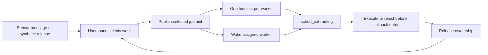

# Architecture

scx-slam-fresh separates application work selection from CPU scheduling.
The application decides which message a worker owns. The scheduler sees a
single hint describing that selection and routes the worker accordingly.

## Components

The BPF scheduler, loader, and MIT client API live in the external `scx_fresh`
repository. This repository owns the workload, ROS adapter, and evaluation.
The version 2 hint ABI selects Urgent, Deadline or Background service explicitly.
The application assigns IMU propagation to Urgent, vision and estimation to
Deadline, and mapping to Background. Sensor IDs remain application diagnostics;
they no longer select a scheduler route.

| Component | Responsibility |
| --- | --- |
| BPF scheduler | Route runnable workers, account execution, apply budget and age rules. |
| Loader | Attach the scheduler, pin maps, configure options, and read events. |
| libfreshqos | Publish a hint for the current thread or an explicitly identified worker. |
| Standalone demo | Generate synthetic sensor jobs and manage FIFO stage queues. |
| ROS FreshnessExecutor | Select callbacks, publish before wake, and release selected messages. |
| Bag adapter | Translate ROS sensor messages into jobs with source identity and monotonic release time. |

The BPF map is not a pending-work queue. It cannot choose another message,
cancel an application callback, or infer that a completed worker is safe to
reassign. Those are executor responsibilities.

## Execution models

The standalone demo has one FIFO consumer per stage queue. A producer publishes
the head item's hint when waking a sleeping consumer. After popping, the
consumer republishes the exact item it selected. Producers must not overwrite
a busy consumer's hint.

The ROS workload uses one executor instance per stage, each with a dispatcher
and one callback worker. Dispatchers and DDS run on a housekeeping CPU.
Workers and synthetic hogs share the experimental CPU. Message-aware
subscriptions are taken directly from DDS; the executor does not copy pending
messages into a second application queue.

For admitted ROS messages, hint ownership extends through the callback's
completion and parking path. The next assignment directly replaces the old
hint. This prevents a completed callback's tail from being stranded in BE
after an intermediate clear. The
[hints contract](DESIGN_HINTS_API.md#executor-contract) defines the ordering
and cleanup requirements.

## CPU scheduling

The custom dispatch queues are served in order: IMU, FE, BE, STALE.
A waking IMU worker can preempt through direct local insertion. FE ordering
alone does not interrupt the currently running slice; this is why background
slice length affects a multi-hop callback chain.

The [scheduler reference](DESIGN_SCHED_ALGO.md) defines the age exemptions,
budget demotion, default slices, and optional BE cap. These rules schedule
threads, not messages.

## Time and identity

Job IDs identify selected work. Scheduler timestamps use `CLOCK_MONOTONIC`.
Bag timestamps remain separate: they identify the fixed dataset window and
must not be used as kernel deadlines. Downstream camera jobs preserve the
camera identity and original monotonic release time, so their deadline is
shared across the chain.

[Evaluation methodology](DESIGN_EVALUATION.md) distinguishes source-window
accounting from callback execution and completion.

## Boundaries

The default build uses partial-switch mode. Other scheduling classes remain
outside these DSQs; pinning workers does not isolate the CPU from unrelated
processes. The kernel can detach a failing scheduler, but that is not a
substitute for testing on a suitable machine.

Strict IMU priority can starve lower lanes at high IMU utilization. Budget
demotion does not cancel work, and executor age protection does not guarantee
progress after a budget overrun. There are no hard real-time guarantees,
GPU scheduling, or mid-callback migration in this implementation.
