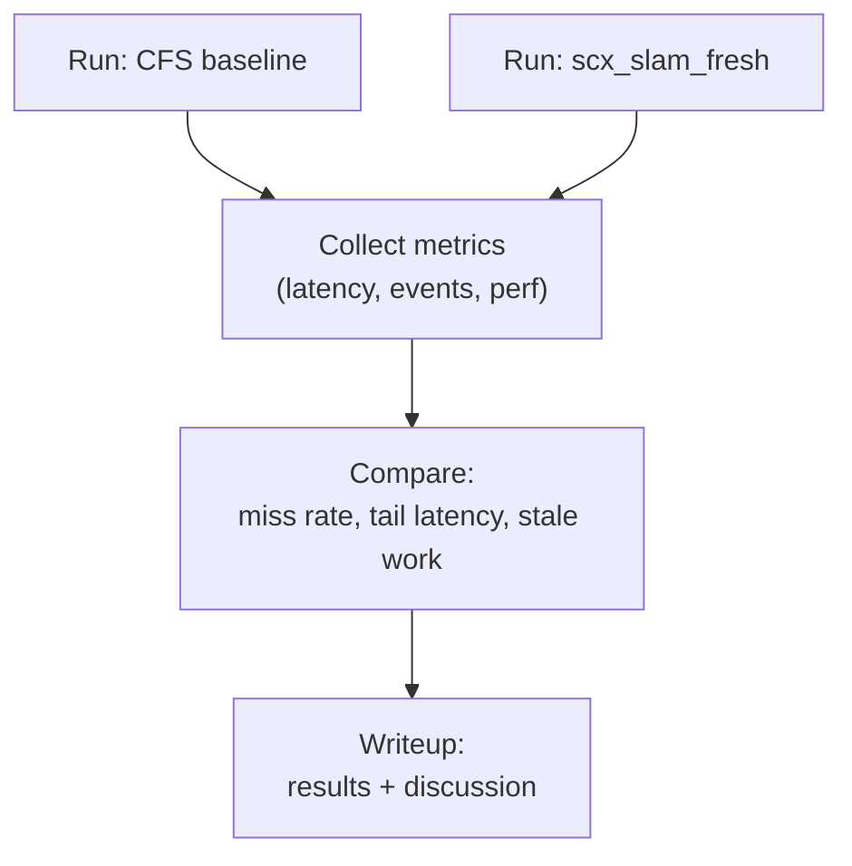

# DESIGN: Evaluation plan

## Metrics
### Per stage
- completion latency (release_ts → stage output)
- deadline miss rate
- stale processing rate (age > stale_ns)
- CPU time spent

### System level
- total throughput (frames/s)
- control-relevant “freshness” of state estimate
- jitter (tail latency)

---

## Experiments

### E1: Overload with heavy backend
- Back-end (mapping) set to 70–90% CPU usage.
- Goal: front-end still meets deadlines.
- Compare CFS vs scx_slam_fresh.

### E2: Sensor burst / backlog
- Inject a burst of camera frames.
- Goal: scheduler prioritizes newest frames and demotes stale backlog.

### E3: Budget misconfiguration
- Set a too-low budget for a front-end stage.
- Goal: observe demotion and increased deadline misses (sanity check).

---

## Harness diagram

