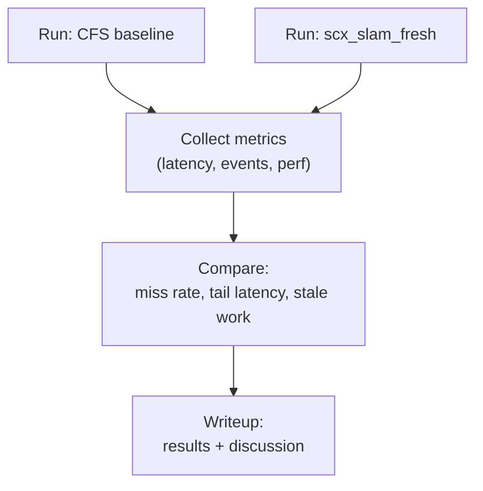

# DESIGN: Evaluation plan

## Metrics
### Per stage
- completion latency (release_ts → stage output)
- deadline miss rate
- stale processing rate (age > stale_ns)
- dropped stale rate (`dropped_stale / stale_seen`)
- CPU time spent

`processed` excludes expired items. `consumer_dropped_stale` counts items rejected
after dequeue, while `queue_evicted_stale` counts expired backlog removed under the
queue lock by a producer. The reported `dropped_stale` is their sum, and
`dequeued = processed + consumer_dropped_stale`. `pending` exposes work left in
the queue when the measurement ends.

### System level
- total throughput (frames/s)
- control-relevant “freshness” of state estimate
- jitter (tail latency)

---

## Workload matrix

The demo is multi-rate: IMU at 200Hz, camera at 30Hz, and LiDAR at 10Hz. LiDAR modes provide increasing registration cost:

- `--lidar off`: no LiDAR stream
- `--lidar light`: sustainable registration load
- `--lidar mid`: borderline load
- `--lidar heavy`: intentionally unsustainable; creates a registration backlog

Additional controls are `--hog N`, `--drop-stale 1`, and `--duration S`.

Sensor generators share one absolute start epoch, use absolute release times, and report generated counts. This keeps the offered input stream and measurement window constant across policies; scheduling delay appears as lateness or backlog rather than silently reducing the generated rate.

---

## Experiments

### E0: LiDAR mode sweep — partially implemented

- The `light`, `mid`, and `heavy` workload modes are implemented.
- Hold CPU affinity and hog count constant.
- Confirm that light remains sustainable, mid approaches saturation, and heavy produces stale LiDAR-registration work.
- Pending: automate the three-mode sweep and assert the expected load regimes.

### ~~E1: Heavy LiDAR overload~~ — completed

Use two matched sub-experiments because strict priority plus two hogs can fully
starve the back-end. A consumer that never runs cannot demonstrate
dequeue-time dropping.

- Deadline isolation: pin the demo to one CPU with heavy LiDAR and two CPU hogs;
  compare CFS with scx_slam_fresh.
- Stale shedding: keep scx_slam_fresh active and use zero CPU hogs; compare
  keeping stale work with `--drop-stale 1`.
- Check front-end deadline misses in the first pair, then stale drops and pending
  backlogs in the second pair.

When stale dropping is enabled, each producer prunes expired queued items before
enqueueing the next release. The in-flight item is not in the queue, and the
producer does not overwrite its active scheduler hint. The consumer still
performs a dequeue-time stale check as a second line of defense.

Run the reproducible matrix:
```bash
make
sudo scripts/run_single_core_eval.sh
```

The script refuses to replace an active sched_ext scheduler, uses a unique BPF pin directory, records the kernel and Git revision, and cleans up only its own loader and pins. Use `REPETITIONS=3` for a less noisy comparison.

Example with explicit controls:
```bash
sudo env CPU=0 DURATION=15 HOG_THREADS=2 STALE_HOG_THREADS=0 REPETITIONS=3 \
  scripts/run_single_core_eval.sh
```

### ~~E2: Sensor burst / backlog~~ — completed

- Inject a deterministic delayed-delivery camera burst while preserving every
  frame's original sensor timestamp.
- Compare matched scx_slam_fresh runs with and without `--drop-stale 1`.
- Require stale dropping to process fewer obsolete burst frames, preserve the
  newest burst frame, and reduce its state-estimate completion age.

The root benchmark enforces all three conditions. Use `BURST_COUNT` and
`BURST_AT_MS` to change the default 12-frame burst delivered near 3000 ms.

#### Latest local verification snapshot

One root run on 2026-08-24 using kernel `7.0.0-30-generic`, CPU 0, 15-second
cases, and one repetition produced:

- E1 isolation: state-estimator deadline misses were 49.0% under CFS and 0.0%
  under scx_slam_fresh.
- E1 stale shedding: LiDAR-registration pending backlog fell from 97 to 3;
  63 expired queued jobs were evicted.
- E2 burst recovery: both policies preserved newest burst frame 92. Stale
  dropping processed 2 rather than 12 burst frames and reduced its
  state-estimate completion age from 109210us to 26111us.

These figures are a development verification snapshot, not a multi-run
performance claim. Reproduce them with the benchmark command above; the script
records the environment, revision, binary hashes, and per-case output in its
chosen results directory.

### E3: Budget misconfiguration
- Set a too-low budget for a front-end stage.
- Goal: observe demotion and increased deadline misses (sanity check).

### E4: IMU-lane isolation
- Sweep IMU compute cost while holding the heavy-LiDAR workload constant.
- Goal: quantify the range in which DSQ_IMU protects propagation without starving FE and BE lanes.
- Report IMU, vision, and estimator misses together; an IMU-only improvement is insufficient.

---

## Harness diagram

