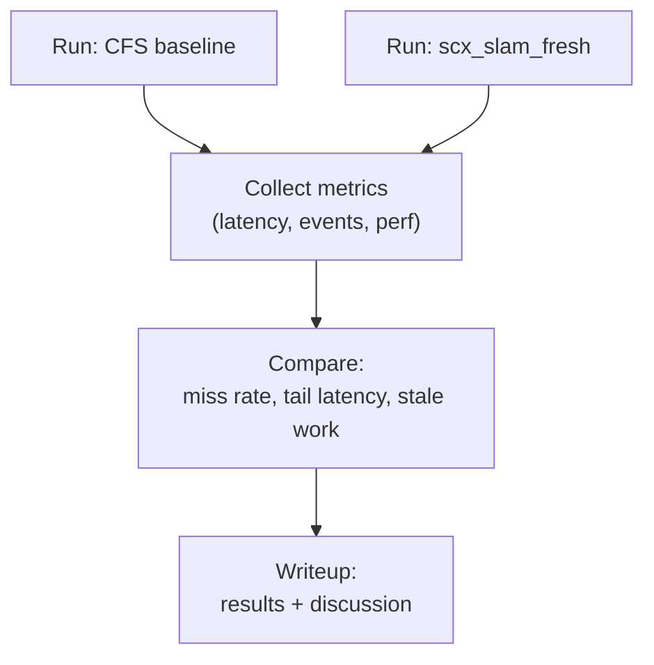

# DESIGN: Evaluation plan

## Metrics
### Per stage
- completion latency (release_ts → stage output)
- deadline miss rate
- stale processing rate (age > stale_ns)
- dropped stale rate (dropped_stale / stale_seen)
- CPU time spent

`processed` excludes items rejected by stale dropping; `dequeued = processed + dropped_stale` makes the accounting explicit.

### System level
- total throughput (frames/s)
- control-relevant “freshness” of state estimate
- jitter (tail latency)

---

## Workload matrix

The demo is multi-rate: IMU at 200Hz, camera at 30Hz, and LiDAR at 10Hz. LiDAR modes provide increasing registration cost:

- `--lidar off`: no LiDAR stream
- `--lidar light`: sustainable registration load
- `--lidar mid`: borderline load
- `--lidar heavy`: intentionally unsustainable; creates a registration backlog

Additional controls are `--hog N`, `--drop-stale 1`, and `--duration S`.

Sensor generators share one absolute start epoch, use absolute release times, and report generated counts. This keeps the offered input stream and measurement window constant across policies; scheduling delay appears as lateness or backlog rather than silently reducing the generated rate.

---

## Experiments

### E0: LiDAR mode sweep
- Hold CPU affinity and hog count constant.
- Confirm that light remains sustainable, mid approaches saturation, and heavy produces stale LiDAR-registration work.

### E1: Heavy LiDAR overload and stale shedding
- Pin the demo to one CPU with heavy LiDAR and two CPU hogs.
- Compare CFS, scx_slam_fresh, and scx_slam_fresh with stale dropping.
- Check front-end deadline misses, stale back-end work, and dropped-stale counts.

Run the reproducible matrix:
```bash
make
sudo scripts/run_single_core_eval.sh
```

The script refuses to replace an active sched_ext scheduler, uses a unique BPF pin directory, records the kernel and Git revision, and cleans up only its own loader and pins. Use `REPETITIONS=3` for a less noisy comparison.

Example with explicit controls:
```bash
sudo env CPU=0 DURATION=15 HOG_THREADS=2 REPETITIONS=3 \
  scripts/run_single_core_eval.sh
```

### E2: Sensor burst / backlog
- Inject a burst of camera frames.
- Goal: scheduler prioritizes newer useful frames and demotes stale backlog.

### E3: Budget misconfiguration
- Set a too-low budget for a front-end stage.
- Goal: observe demotion and increased deadline misses (sanity check).

### E4: IMU-lane isolation
- Sweep IMU compute cost while holding the heavy-LiDAR workload constant.
- Goal: quantify the range in which DSQ_IMU protects propagation without starving FE and BE lanes.
- Report IMU, vision, and estimator misses together; an IMU-only improvement is insufficient.

---

## Harness diagram

