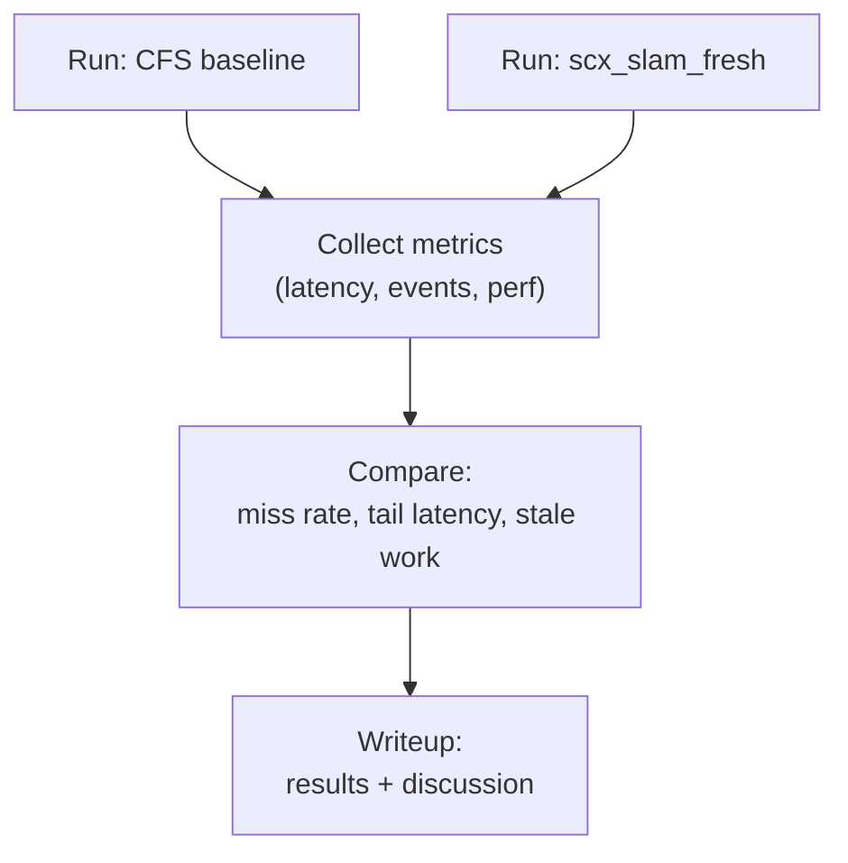

# DESIGN: Evaluation plan

## Metrics
### Per stage
- completion latency (release_ts → stage output)
- deadline miss rate
- stale processing rate (age > stale_ns)
- dropped stale rate (`dropped_stale / stale_seen`)
- CPU time spent (`cpu_us`)

`processed` excludes expired items. `consumer_dropped_stale` counts items rejected
after dequeue, while `queue_evicted_stale` counts expired backlog removed under the
queue lock by a producer. The reported `dropped_stale` is their sum, and
`dequeued = processed + consumer_dropped_stale`. `pending` exposes work left in
the queue when the measurement ends. Synthetic compute waits on
`CLOCK_THREAD_CPUTIME_ID`, and `cpu_us` sums that thread CPU time around each
job. Release time, deadlines, staleness, and completion latency remain wall-age
measurements on `CLOCK_MONOTONIC`, matching BPF `bpf_ktime_get_ns()`.

### System level
- total throughput (frames/s)
- control-relevant “freshness” of state estimate
- jitter (tail latency)

---

## Loaded ROS 2 callback scheduling snapshot

This snapshot is separate from E0-E4. It measures the optional ROS 2 pipeline,
not the standalone demo or the E4 IMU-load regimes. A clean three-repetition
run used kernel `7.0.0-31-generic`, CPU 0 for callback workers and two CPU hogs,
CPU 1 for DDS/RMW, publishers, and executor dispatch, 15-second fixed windows,
ROS 2 Lyrical, `ops_flags=0x8`, and `switch_all=0`. The source revision was
`f01e3f91c519325e5e06f0d42fd0a08bb872cc85`; scheduler policy last changed in
`0252acc`. The captured binaries were:

- ROS pipeline: `38a15888215e17aced3a0c8ffe99932bd0c61adb2ca0f35c77d63ec5293920e5`
- loader: `3dd5519925781964d451c1039017404169d8384deb835bce811e95ddca35243f`
- BPF object: `75719c3ac6959b41e80fdeb4975538aa28b9bb65eadfa42eedc6e858d42a1860`

The matched command selected CFS plus all four SCX metadata variants:

```bash
sudo env CPU=0 HOUSEKEEPING_CPU=1 DURATION=15 HOG_THREADS=2 \
  REPETITIONS=3 SCX_VARIANTS=hinted,no-hints,imu-only,fe-only \
  scripts/run_ros2_eval.sh
```

The IMU result isolates throughput and period survival. Values below are the
three repetitions; p99 columns give the range across those repetitions.

| Policy | IMU completed | late | unfinished | p99 start age | p99 completion age |
| --- | --- | --- | --- | ---: | ---: |
| CFS | 3000, 3000, 3000 | 1, 0, 1 | 0, 0, 0 | 2.897-2.901ms | 3.049-3.053ms |
| hinted | 3000, 3000, 3000 | 0, 0, 0 | 0, 0, 0 | 0.114-0.242ms | 0.266-0.398ms |
| no hints | 1876, 1878, 1878 | 1874, 1875, 1876 | 1124, 1122, 1122 | 5013.703-5014.427ms | 5013.856-5014.580ms |
| IMU only | 3000, 3000, 3000 | 0, 0, 0 | 0, 0, 0 | 0.136-0.149ms | 0.288-0.301ms |
| FE only | 3, 4, 4 | 1, 1, 1 | 2997, 2996, 2996 | 18.122-20.372ms | 18.274-20.525ms |

The other stages completed 450 jobs per repetition except FE-only mapping,
which completed 449. Start and completion age remain separate: the table shows
the range of each run's p99, not a pooled percentile.

| Policy | Vision start / completion | Estimator start / completion | Mapping start / completion |
| --- | ---: | ---: | ---: |
| CFS | 5.385-5.557 / 16.650-17.058ms | 19.927-21.241 / 28.602-29.913ms | 30.244-31.381 / 34.276-35.522ms |
| hinted | 3.595-3.673 / 8.756-8.833ms | 13.590-13.612 / 16.593-16.620ms | 18.585-18.614 / 20.587-20.617ms |
| no hints | 20.861-20.948 / 25.199-25.458ms | 25.386-25.653 / 28.307-28.465ms | 28.494-29.023 / 30.497-31.026ms |
| IMU only | 3.601-3.608 / 8.762-8.774ms | 13.598-13.600 / 16.600-16.604ms | 18.595-18.597 / 20.598-20.600ms |
| FE only | 18.878-19.124 / 23.386-23.626ms | 43.862-44.123 / 46.625-46.876ms | 54.422-54.661 / 56.426-56.668ms |

On this one-core, two-hog ROS pipeline, hinted `scx_slam` cuts callback-start
tails versus CFS without dropping work. The same workers and hogs all use
`SCHED_EXT` in the no-hint case, but anonymous BE service completes only about
1877/3000 IMU callbacks and leaves about 1123 unfinished. Entering scheduling
class 7 is therefore not the win.

Full hinting and IMU-only hinting are indistinguishable here, including vision
and estimator tails. Once the dedicated IMU path is protected, FE metadata for
vision and estimation adds no measurable benefit on this graph and load.
Ordinary-FE IMU is not a substitute: it becomes stale around job 4 or 5, moves
to the stale lane, and completes only 3-4 callbacks. This reproduces the
late/stale-demotion feedback shape observed in E4, but it is not part of the E4
snapshot.

The dedicated IMU path is still a bundle: `DSQ_IMU` routing, wakeup preemption,
and exemption from stale/late demotion were not separated. This snapshot does
not establish no-contention safety, replay a bag, run a real estimator, add
LiDAR to the ROS graph, or compare against FIFO, DEADLINE, or another sched_ext
scheduler. It is scoped synthetic-work evidence for the loaded
callback-compute boundary on this kernel, revision, CPU pin, and binary set.
The separate zero-hog maximum-tail diagnosis is recorded below.

### Zero-hog partial-switch interference diagnosis

This diagnostic is separate from both the loaded two-hog matrix above and
E0-E4. It used the same `f01e3f9` ROS pipeline, loader, and BPF binaries with
hinted partial-switch SCX, no synthetic hogs, 15-second fixed windows, and
three repetitions.

With callback workers pinned to an unshielded CPU 0 and DDS/dispatch on CPU 1,
standard `sched_switch` and `sched_wakeup` traces showed that CPU 1 woke the IMU
worker after its expected 4.5-4.9ms sleep. The IMU then remained runnable for
44-48ms while foreign `SCHED_NORMAL` browser or compositor workers ran on CPU
0. In partial-switch mode those fair-class tasks remain outside the SCX DSQs
and have higher scheduling-class precedence than `SCHED_EXT`; neither the IMU
lane nor SCX wakeup preemption can preempt them. Pinning this workload's worker
threads did not prevent unrelated processes from using the same CPU.

The matched shielded capture moved the workers to CPU 14, kept CPU 1 for
DDS/dispatch, and left the SMT sibling CPU 15 unused. Linux rejects sched_ext
registration with `isolcpus=domain`, so scheduler-domain isolation was not
used. The effective boot configuration instead retained tick, RCU, and IRQ
isolation while systemd kept its service tree off CPUs 14-15:

```text
isolcpus=managed_irq,14-15 nohz_full=14-15 rcu_nocbs=14-15 irqaffinity=0-13 systemd.cpu_affinity=0-13
```

After reboot, `/sys/devices/system/cpu/nohz_full` reported `14-15` and PID 1's
`Cpus_allowed_list` reported `0-13`. The worker explicitly selected CPU 14.

| Capture | IMU completed / late / started stale | p99 start age | maximum start age |
| --- | --- | ---: | ---: |
| Unshielded CPU 0 | 3000 / 9-14 / 8-12 | 1.213-1.258ms | 44.402-47.936ms |
| Shielded CPU 14 | 3000 / 0 / 0 | 0.633-0.777ms | 1.167-2.532ms |

Each range covers three repetitions. Short kernel and desktop occupants still
appeared on CPU 14, so this is not an absolute reserved-core claim. They did
not reproduce the 40ms-class runnable wait or cause an IMU deadline miss. The
zero-hog tail is therefore closed as unshielded fair-class interference; no
scheduler-policy change was made.

---

## Workload matrix

The demo is multi-rate: IMU at 200Hz, camera at 30Hz, and LiDAR at 10Hz. LiDAR modes provide increasing registration cost:

- `--lidar off`: no LiDAR stream
- `--lidar light`: sustainable registration load
- `--lidar mid`: borderline load
- `--lidar heavy`: intentionally unsustainable; creates a registration backlog

Additional controls are `--hog N`, `--drop-stale 1`, `--duration S`,
`--imu-work-us N` (default 150us per fixed 5ms period), and the
vision-stage `--vision-budget-us`, `--vision-work-us`, and
`--vision-deadline-us` knobs.

Sensor generators share one absolute start epoch, use absolute release times, and report generated counts. This keeps the offered input stream and measurement window constant across policies; scheduling delay appears as lateness or backlog rather than silently reducing the generated rate.

---

## Experiments

### ~~E0: LiDAR mode sweep~~ — completed

- Run `light`, `mid`, and `heavy` under CFS with identical CPU affinity, hog
  count, and duration.
- Require light and mid to drain every registration job without stale work or
  pending backlog.
- Require strictly increasing registration costs, with mid consuming 50-100ms
  of each 100ms LiDAR period and heavy exceeding the period.
- Require heavy to process fewer jobs than generated and accumulate both stale
  and pending registration work.

The root benchmark runs and enforces this sweep before attaching sched_ext.
Run only this calibration with:
```bash
sudo env EVAL_SCOPE=e0 scripts/run_single_core_eval.sh
```

### ~~E1: Heavy LiDAR overload~~ — completed

Use two matched sub-experiments because strict priority plus two hogs can fully
starve the back-end. A consumer that never runs cannot demonstrate
dequeue-time dropping.

- Deadline isolation: pin the demo to one CPU with heavy LiDAR and two CPU hogs;
  compare CFS with scx_slam_fresh.
- Stale shedding: keep scx_slam_fresh active and use zero CPU hogs; compare
  keeping stale work with `--drop-stale 1`.
- Check front-end deadline misses in the first pair, then stale drops and pending
  backlogs in the second pair.

When stale dropping is enabled, each producer prunes expired queued items before
enqueueing the next release. The in-flight item is not in the queue, and the
producer does not overwrite its active scheduler hint. The consumer still
performs a dequeue-time stale check as a second line of defense.

Run the reproducible matrix:
```bash
make
sudo scripts/run_single_core_eval.sh
```

The script refuses to replace an active sched_ext scheduler, uses a unique BPF pin directory, records the kernel and Git revision, and cleans up only its own loader and pins. Use `REPETITIONS=3` for a less noisy comparison.

Example with explicit controls:
```bash
sudo env CPU=0 DURATION=15 SWEEP_DURATION=8 HOG_THREADS=2 \
  STALE_HOG_THREADS=0 REPETITIONS=3 \
  scripts/run_single_core_eval.sh
```

### ~~E2: Sensor burst / backlog~~ — completed

- Inject a deterministic delayed-delivery camera burst while preserving every
  frame's original sensor timestamp.
- Compare matched scx_slam_fresh runs with and without `--drop-stale 1`.
- Require stale dropping to process fewer obsolete burst frames, preserve the
  newest burst frame, and reduce its state-estimate completion age.

The root benchmark enforces all three conditions. Use `BURST_COUNT` and
`BURST_AT_MS` to change the default 12-frame burst delivered near 3000 ms.

#### Replacement verification snapshot — partial-switch

A three-repetition root run on 2026-09-04 used kernel
`7.0.0-30-generic`, CPU 0, 15-second cases, 8-second E0 sweeps, two
isolation/E3 hogs, and no stale-shedding hogs. The scheduler reported
`ops_flags=0x8` (`SCX_OPS_SWITCH_PARTIAL`) with `switch_all=0`. The clean
source revision was `749b57921a802eb720f8b1d1951b50a5044131bf`; scheduler
policy last changed in `0252acc`. The captured binaries were:

- demo: `9707cc74b5a19b11f007d3790aa7d1773b3c796c0c4b3cec3168947d5e5e8b00`
- loader: `daba71b9ce31716b8f837951f6a579c1221d7feb151c941eb8979e054de12c8c`
- BPF object: `054ec129d16803dc292821923b555c535683b807e3324150ef2a89cb97498a28`

The benchmark completed all 33 cases and its assertions passed. Process-lifetime
totals, rather than E4's fixed-window counters, produced this snapshot.

| E0 mode | `reg_job_us` | registration completed | late | pending | registration `cpu_us` |
| --- | ---: | ---: | ---: | ---: | --- |
| light | 15804 | 80/80 | 0 | 0 | 1264447, 1264434, 1264439 |
| mid | 51846 | 80/80 | 0 | 0 | 4147789, 4147791, 4147795 |
| heavy | 280919 | 15/80 | 15 | 65 | 4213808, 4213807, 4213813 |

E1 deadline isolation reproduced across all three matched runs. Under CFS the
state estimator completed 454/455 jobs and missed 265, 263, and 269 deadlines
(58.4%, 57.9%, and 59.3%), with `cpu_us` 1363624, 1363657, and 1363631. Under
scx_slam_fresh it completed 455/455 with zero misses and zero pending in every
run, with `cpu_us` 1365634, 1365621, and 1365633.

E1 stale shedding also reproduced independently with zero hogs:

| Policy | registration processed | pending | queue-evicted | consumer-dropped | total dropped |
| --- | --- | --- | --- | --- | --- |
| keep | 28, 28, 28 | 122, 122, 122 | 0, 0, 0 | 0, 0, 0 | 0, 0, 0 |
| drop | 28, 28, 28 | 3, 3, 3 | 99, 100, 100 | 20, 19, 19 | 119, 119, 119 |

E2 injected burst jobs 81 through 92. Keeping stale work processed all 12 burst
frames and completed state estimation for frame 92 at 109403, 109403, and
109404us of age. Dropping stale work processed two burst frames, still
preserved frame 92, and reduced its state-estimate age to 13759, 14040, and
13808us. Vision completion age for that newest frame fell from 101478, 101645,
and 101646us to 8059, 8353, and 8121us.

E3's 16ms budget completed 455/455 vision jobs with zero late, zero pending,
zero overruns, and zero demotions in every run. Its 1ms counterpart completed
19/455, missed four deadlines, left 436 pending, and emitted 19 overrun plus 19
confirmed demotion events in every run. Both used 12ms of vision CPU work and a
30ms deadline.

These are observations for this kernel, CPU pin, workload, revision, and binary
set. They validate the E0-E3 harness claims on that pin; they are not universal
performance guarantees or a scheduler-policy change.

#### Withdrawn 2026-09-02 full-switch snapshot

The E4 preflight exposed a build bug on 2026-09-03: an `#ifdef` tested
`SCX_OPS_SWITCH_PARTIAL`, which is an enum constant rather than a macro. It
silently omitted the partial-switch flag; the inspected object had `flags=0`
(full switch). The flag is now required directly in the default build, and the
loader can report its embedded flags without attaching. The CFS-only E0 sweep
was unaffected by this switch-mode defect. The figures below are kept as
historical observations and are superseded by the replacement snapshot above.

One root run on 2026-09-02 using kernel `7.0.0-30-generic`, CPU 0, 15-second
cases, and one repetition produced:

- E0 sweep: light and mid completed 80/80 registration jobs with no stale or
  pending work; heavy completed 15/80, observed 14 stale jobs, and left 65
  pending. Nominal registration costs were 15804us, 51846us, and 280919us.
- E1 isolation: state-estimator deadline misses were 58.8% under CFS and 0.0%
  under scx_slam_fresh.
- E1 stale shedding: LiDAR-registration pending backlog fell from 122 to 3;
  96 expired queued jobs were evicted.
- E2 burst recovery: both policies preserved newest burst frame 92. Stale
  dropping processed 2 rather than 12 burst frames and reduced its
  state-estimate completion age from 114387us to 15374us.
- E3 budget validation: with fixed 12ms vision CPU and a 30ms deadline, the
  correctly sized 16ms budget completed 455/455 jobs with no misses. A 1ms
  budget produced 14 overrun events, 14 confirmed BE-demotion events, completed
  14/455 jobs with 2 misses, and left 441 pending.

This snapshot used thread CPU time rather than the earlier elapsed-wall-time
compute model; those two workload models are not comparable. It also predates
the corrected partial-switch build and is not a multi-run performance claim.

### ~~E3: Budget misconfiguration~~ — completed

- Compare matched scx_slam_fresh runs with fixed 12ms vision CPU and a 30ms
  relative deadline.
- Require the 16ms control budget to produce no overrun or demotion events.
- Require a 1ms budget to produce both overrun and confirmed BE-demotion
  events, while increasing vision deadline misses.
- Require the control run to drain every offered vision job so startup
  starvation cannot masquerade as a budget result.

Run E3 alone with:
```bash
sudo env EVAL_SCOPE=e3 scripts/run_single_core_eval.sh
```

### ~~E4: IMU-lane isolation~~ — observational regimes validated
- Sweep IMU compute cost while holding the heavy-LiDAR workload constant.
- Goal: quantify the range in which DSQ_IMU protects propagation without starving FE and BE lanes.
- Report IMU, vision, and estimator misses together; an IMU-only improvement is insufficient.

#### Capture protocol and exploratory diagnostics

```bash
make
make test-demo test-e4 test-scheduler-mode test-window
python3 scripts/run_e4_eval.py --dry-run
sudo python3 scripts/run_e4_eval.py
```

The separate runner leaves the E0–E3 workloads unchanged. Defaults are one CPU
(CPU 0), 15 seconds of sensor releases, heavy LiDAR, zero hogs, stale dropping
off, default vision compute/deadline/budget, and the existing partial-switch
scheduler policy. Only IMU compute cost changes. Zero hogs leaves a measurable
BE reference; this is not the two-hog E1 isolation workload.

Costs are 150, 500, 1000, 2000, 3000, 4000, 4500, 4750, 5000, 5500, and 6000us
(3–120% of the 5ms period). Each repetition starts and ends with a 150us control;
the interior points are shuffled reproducibly with seed 4. The end control
checks drift, not a second denominator. Use `--cpu`, `--duration`, `--costs`,
`--repetitions`, and `--seed` to override these settings. `--output` must name a
new directory; otherwise the runner creates a temporary results directory.

Artifacts include raw per-case output, loader events, commands, environment and
binary hashes, the runner/header sources, a tracked-source diff, `cases.json`,
`matrix.csv`, `stages.csv`, and `drain.csv`. Results are saved after each successful case.
Embedded full-switch flags are rejected before attachment. After attachment,
live guards report the loader exit code, state, enable sequence, and switch mode.
Timeout, attach loss/change, full-switch mode, hint-publication errors, and
inconsistent input/accounting mark the capture incomplete, never a pass. Cleanup
terminates only the processes and removes only the BPF pins created by this run.

#### Fixed window and drain

E4 enables `--window-stats`. The observation interval is the generators' shared
`CLOCK_MONOTONIC` epoch through epoch + duration, **not process exit**. Counters
are reconstructed from timestamped events, not read by a potentially delayed
observer thread. Queue operations are timestamped under their queue lock;
completions and stale-at-start observations are timestamped by the worker.
An event at the cutoff belongs to drain. Underloaded runs stay alive at least
until the cutoff; overloaded IMU ticks still drain, preserving the behavior
being diagnosed.

`window_STAGE` / `stages.csv` report offered, completed, late completions,
stale-at-start/evicted work, dropped work, pending queue entries, in-flight work,
compute CPU, and rate (`window completions / window seconds`). Queued stages'
offered count is **actually delivered to that stage before the cutoff**, not
future upstream outputs. The implicit IMU queue offers every tick scheduled in
the window. Source sensor counts and source deliveries delayed past the cutoff
are retained separately. The identity is:

`offered = completed + dropped_stale + pending + in_flight`

The console, `matrix.csv`, and `stages.csv` also report
`unfinished = pending + in_flight` for each stage. This counts work already
delivered, not upstream work that has yet to arrive. The matrix retains raw
offered/completed/late counts, queue/in-flight counts, and CPU for every stage.
`vision_to_estimator_not_delivered_at_cutoff` is vision window completions
minus estimator window arrivals; it is separate from the estimator backlog.
The console shows vision output and estimator arrival rates alongside it.

Late counts apply to completed jobs, not outstanding jobs; read them alongside
pending and in-flight counts. A zero-completion miss fraction is undefined,
not 0%. IMU stale observations are now counted at job start as for other stages;
the IMU still never drops these jobs. Vision CPU and lateness are separate fields.

**CPU boundary precision:** compute loops bracket thread-CPU clock reads with
monotonic reads. A sample wholly before the cutoff updates a lower CPU bound;
the first sample provably after the cutoff bounds the missing CPU above. There
is no proportional interpolation across preemption. `cpu_ns` (and truncated
`cpu_us`) in the window is the lower bound; `cpu_uncertainty_ns` exposes its
remaining interval. This includes in-flight job compute. CPU refers to synthetic
compute, not all hint/queue bookkeeping. Instrumentation is opt-in and enabled
identically for both probe variants; all release/deadline/freshness clocks stay
monotonic. Inspect uncertainty before treating differences as meaningful.

`drain_STAGE` / `drain.csv` hold post-cutoff completions, lateness and CPU, never
classifier inputs. Drain CPU is total minus the window lower bound, hence an
upper bound with the same uncertainty. Window plus drain CPU nanoseconds and
completion counts reconcile with totals. `measurement` records exact intended
epochs and elapsed/drain wall time through worker shutdown; process elapsed
also includes startup overhead and is reported separately.

LiDAR-registration and mapping get **separate** fixed-window rate ratios to the
starting 3% control for the same repetition and preemption variant. There is no
combined BE ratio: cheap mapping completions must not conceal lost registration
service. A zero-progress control has an undefined ratio.

#### Diagnostic chronology — retained, not current work

The probe subsections below preserve the investigation that led to the validated
regimes. Their “next” steps are historical sequencing, not recommendations to
rerun probes before E1–E3. All diagnostic switches remain default-off.

#### IMU preemption probe — historical hypothesis test

The first, drain-inclusive pilot showed roughly 50% whole-run IMU CPU share
once IMU became persistently late. That is not proof that 60% offered IMU work
exceeds capacity. One hypothesis is a change from wakeup preemption to
non-wakeup slice sharing; the actual enqueue flags must establish whether that
transition occurs. In particular, do not assume an expired absolute sleep
does or does not produce a wakeup.

```bash
sudo python3 scripts/run_e4_eval.py --preempt-probe
```

The default diagnostic grid is 150, 2000 and 3000us, on one CPU with the same
heavy-LiDAR offered load. It brackets paired `wakeup` and `always` variants with
their own 3% controls, shuffles cost/mode order using the recorded seed, and
starts a fresh loader per case. `--costs` can override this grid. Both variants
use the **same demo and embedded BPF binary**: loader-set read-only BPF options
select the probe before attachment. Default `--imu-preempt wakeup` retains
wakeup-only direct-local preemption and non-wakeup `DSQ_IMU` insertion;
`--imu-preempt always` sends every hinted IMU enqueue to local preemption.
Nothing changes the default policy, budgets, stale handling, or sleep behavior.

Both probe variants enable `--trace-imu`. Enqueue records include monotonic
timestamp, worker pid_tgid, job/stage, hint presence, scheduler policy, raw
enqueue flags, wakeup/late indicators, enqueue-context CPU, and assigned DSQ.
The IMU worker names itself `imu_prop` for diagnostics, so missing/wrong-stage
hints are visible too; this name is never a scheduling input. Userspace also
reports its actual policy after setting `SCHED_EXT`. The harness verifies worker
identity, policy and CPU, and writes per-case `imu-enqueues.csv` with startup,
window and drain phases. `DSQ_IMU` is the normal non-wakeup destination; the
always-preempt probe intentionally routes those enqueues directly to local.

To bound observer overhead, ring events sample at most one enqueue per job and
(wakeup, late) combination, plus stage changes. Unsampled per-CPU counters track
all matched enqueues/routes, missing hints, wrong policy/stage, and ring loss
over the **whole case**. Do not mistake sample counts for enqueue frequencies
or whole-case counters for fixed-window counts. Loss is explicit; tracing is
disabled outside the opt-in probe.

The comparison used `imu_window_cpu_pct`, `imu_total_cpu_pct` (total compute /
elapsed since epoch), fixed-window misses, split BE rates and late enqueue routes. If always
preempt changes the 60% row, that supports the slice-sharing hypothesis; if it
does not, inspect other causes rather than selecting admission control. No
thresholds are frozen, no regime is assigned, and no slack stealing, lower-lane
floor or admission knob was introduced. E4 remained open at this point in the
investigation; the later seeded grid validated the observational regimes. Older
drain-inclusive logs are rejected by the fixed-window parser rather than silently
reinterpreted.

#### Execution probe — historical blocked-versus-runnable diagnosis

When the enqueue-path A/B did not recover IMU service, the next observation in
the investigation was execution, not another policy mechanism:

```bash
sudo python3 scripts/run_e4_eval.py --execution-probe
```

This implies the preemption probe, with default costs 150 and 3000us. Both
variants retain their starting/ending 3% controls: six cases at the same pin,
15-second release epoch, heavy LiDAR, zero hogs and no stale dropping. The
existing `always` diagnostic remains opt-in; wakeup-only remains the default.
No sleep, budget, dispatch, or slice policy is changed.

The loader's opt-in `--trace-execution-cpu N` attaches raw `sched_switch` and
`sched_wakeup` tracepoints and records IMU `running`/`stopping` callbacks. Raw
syscall entry/exit hooks retain only the IMU's active syscall **number**, not
arguments, user memory, or stacks. A blocked switch-out can therefore be
associated with `clock_nanosleep`, `nanosleep`, `futex`, another syscall, or no
observed syscall; this is context, not proof of the precise kernel wait site.
The four raw tracepoint programs are not loaded/attached in ordinary runs.

All switches on the selected CPU are recorded, including non-EXT tasks and
idle. Wakeups are captured even when their source CPU differs. Each switch
includes both tasks' pid_tgid, comm, policy, stage hint, EXT remaining slice,
last insertion timestamp/destination, and requested slice. The DSQ field is
**last insertion provenance**, not an independently observed dequeue source;
a resumed task can reuse its slice without another insertion. `running` and
`stopping` record the IMU slice and callback residency independently of actual
switches, including callback cycles without a switch to another thread.

The analysis clips all intervals to the demo's exact monotonic epoch. It uses
the tracepoint's saved `prev_state` and preemption flag: preemption is runnable
even if raw state is nonzero. A blocked gap ends at the wakeup; wakeup to
switch-in is runnable waiting. Off-CPU time in `exit`/`exit_group` is a separate
termination-path category (the final control tick can finish just before T),
not sleep starvation. CPU occupancy is intersected with this state
timeline, so every task in a gap is accounted for, not just its first successor.
Startup/drain events remain in the raw capture but cannot inflate window rates.

Artifacts per case:

- `execution.csv`: all raw diagnostic records with phase and decoded comm.
- `execution-intervals.csv`: window-only IMU states joined to CPU occupants.
- `cpu-occupancy.csv`: window time by IMU state, syscall context, task and policy.
- `switch-away.csv`: immediate successors, observed run intervals, incoming
  slice and outgoing IMU start/remaining slice, including phase labels.
- `execution-summary.json`: window scheduled/blocked/runnable times, independent
  callback residency, and the demo's compute CPU counter.

Scheduler residency is elapsed scheduled time: it includes non-compute work
and may include interrupt time. It is not interchangeable with thread CPU
measured around compute. Requested slice zero and observed remaining slice are
reported separately; do not interpret a zero request as an observed duration.

The execution stream uses a separate ring and unsampled emitted/lost counters.
The harness requires matching identity/policy, continuous switch and callback
coverage, and full window coverage. Loss, identity conflicts, migration, or
ambiguous wake/switch races invalidate attribution; raw evidence is retained.
The trace consumer is pinned to allowed CPUs other than the measured CPU, and
its command/affinity is recorded. Instrumentation still has overhead: compare
the newly traced controls and do not treat this as a replacement performance
baseline. No cause label, E4 pass, threshold, or admission verdict was generated.

#### Zero-slice translation A/B — implementation check only

The hint API's `slice_ns=0` means scheduler default. The kernel insertion API's
zero instead preserves the residual slice, using 1ns when exhausted. Translate
zero (including missing-hint/state fallbacks) to an explicit `SCX_SLICE_DFL`
(20ms); preserve every nonzero hint. This fix does not change `dispatch(prev)`,
preemption defaults, budgets, or introduce a deadline-dependent slice.

For this one comparison, the existing execution probe can check the observed
IMU `running` slices as well as window compute CPU and split BE rates:

```bash
sudo python3 scripts/run_e4_eval.py --execution-probe --wakeup-only --costs 150,2000,3000
```

This selects four cases: 3% control, shuffled 40%/60% points, and a closing 3%
control, all wakeup-only. Run the **same command and tracing settings** against
archived pre-fix binaries by adding `--binary-dir /path/to/pre-fix-binaries`.
That directory must contain the demo, loader (with its embedded BPF object),
and BPF object. Archived mode intentionally skips source freshness checking;
live partial-switch checks and per-case binary hash checks remain mandatory.
The output distinguishes the current source tree from archived binaries and
copies archived scheduler sources when provided. Ordinary runs still require
`make -q` and keep all probe flags off.

Verify disappearance of the unintended 1ns refill at fresh IMU starts; residual
slices after interruption need not equal 20ms. Report window CPU, misses and
LiDAR rate even if they worsen. Removing the 1ns signature establishes the
translation correction, not a recovered service band or E4 pass. Any follow-up
`prev` handling is a separate change after this evidence. Do not freeze
thresholds on the old 1ns matrix. This is not a commitment to retain custom
tracing: prefer `perf sched`/standard switch tracing for subsequent gap analysis.

#### Post-fix refinement — historical repetitions without tracing

After the slice translation A/B, the investigation refined the critical-stage
transition with 60/65/70/75/80% IMU work and three repetitions:

```bash
sudo python3 scripts/run_e4_eval.py --costs 150,3000,3250,3500,3750,4000 --repetitions 3
```

This is 21 cases: each repetition starts and ends at the 3% control, with the
five intermediate costs shuffled using the recorded seed. Windows stay at
15 seconds on one pinned CPU, with heavy LiDAR, no hogs and no stale dropping.
No probe flags are enabled; wakeup-only preemption and `dispatch(prev)` remain
unchanged. Each row names its own repetition's starting control; ending-control
ratios expose drift rather than silently changing the denominator.

Read IMU, vision and estimator completed/late/unfinished counts together with
per-stage CPU. Keep registration and mapping ratios separate, and include
LiDAR preprocessing completed/late counts. At 80%, compare estimator arrivals
and pending/in-flight work against vision output: a queued estimator job is
not a missing handoff. These repetitions were exploratory, not independent
validation of frozen thresholds. No safe band, mechanism choice, or E4 pass
was implied.

#### Estimator transition probe — standard scheduler timeline plus lane records

The three-repetition refinement located a repeatable transition: 65% IMU kept
all 455 estimator jobs on time, while 70% completed 240, with 237 late and 215
unfinished. Existing logs put the first observed estimator deadline miss at
approximately 135.052, 135.054, and 135.029ms after the three epochs (job 4).
The first observed stale demotion was job 6 at approximately 255.053, 255.053,
and 255.029ms. Those old logs printed rounded age rather than exact timestamps;
they bound the focus window but are not exact event times. The corresponding
65% runs logged no estimator miss/demotion.

Capture the 65/70 transition without another load sweep:

```bash
sudo python3 scripts/run_e4_eval.py --perf-sched
```

This runs four cases: 3% starting control, shuffled 65% and 70%, then the 3%
ending control. It records only switch, waking, new-wakeup, fork, and migration
events system-wide so
off-CPU wake sources remain visible; the benchmark and scheduler stay pinned as
before, while recorder/loader observers are moved off the measured CPU. Perf
uses the monotonic clock. The runner reports a common interval for each
repetition: 100ms before that repetition's first observed 70% estimator miss
through two seconds after it. Full perf data remains available outside the
focused report. Do not use `perf sched record` here: it additionally enables
`sched_stat_runtime`, whose event volume during thread-CPU busy loops is both
large and intrusive.

All workers and generators set distinct Linux thread names before the workload
epoch so standard perf records identify stages directly. Naming is diagnostic
metadata only; scheduler classification continues to use published hints.

`perf sched` supplies switch, runnable-wait, blocked-state and incoming-task
evidence. It does not expose this scheduler's custom DSQ destination. Therefore
the same opt-in run records every estimator enqueue in the existing scheduler
ring: exact monotonic timestamp, pid_tgid/job/hint times, enqueue flags,
destination DSQ, requested slice, accumulated vruntime, per-job execution,
overrun, policy and CPU. Per-CPU totals require `emitted == enqueues` and zero
loss before lane attribution. These are insertion destinations, **not observed
dequeues**. No new tracepoint BPF program is attached.

Artifacts include the raw `perf.data`, focused decoded perf events, estimator and CPU
`timehist` views, all estimator lanes/events, a focused estimator-lane CSV, and
JSON with the exact first-observed event and report bounds. Perf-reported loss,
missing switch records, estimator-ring loss, identity/policy/CPU changes, or an
unknown lane make attribution invalid while retaining raw evidence. Ordinary
scheduler events do not have a loss counter, so “first observed” is deliberately
not called “proven earliest.” All instrumentation is default-off. This probe
changes no hints, dispatch logic, lane policy, workload, threshold, or E4 status.

#### Grace A/B — historical first-miss falsification probe

Once the separate 65/70 capture reproduced the transition, the next
falsification probe was the global late-demotion grace A/B:

```bash
sudo python3 scripts/run_e4_eval.py --grace-probe
```

This brackets two shuffled 70% IMU cases with 3% controls. Both 70% cases use
the same current BPF object, wakeup-only IMU preemption, workload, and lean perf
event set; the loader selects either the unchanged 1ms grace or zero grace in
read-only BPF configuration before attachment. The default remains 1ms for all
ordinary runs.

The demo records exact monotonic release, completion age, and lateness for
vision and estimator job 4. The estimator report also records job 4's observed
enqueue lanes and whether observed jobs 5 onward remain entirely in `DSQ_FE` or
touch another lane. This separation matters because grace is global: zero grace
can alter both the upstream LiDAR-preintegration interference and the victim
estimator's recovery after its first miss.

The A/B does not define success as a lower aggregate miss count. It asks two
narrow questions: whether estimator job 4 remains FE and finishes by its
deadline, and whether later estimator jobs remain FE. Job 4 still missed, so
zero grace was insufficient to falsify or establish the upstream budget-tripwire
model; that result led to the earlier LiDAR-preintegration budget-demotion
probe. No dispatch, lane-classification, preemption, lower-lane floor,
admission, threshold, or E4 status change was part of this run.

#### LiDAR-pre budget A/B — upstream tripwire isolation

Because zero grace changed the collapse but estimator job 4 still missed, the
investigation retained the default 1ms grace and isolated how long LiDAR
preprocessing remained in FE:

```bash
sudo python3 scripts/run_e4_eval.py --lidar-pre-budget-probe
```

This uses the same four-case shape and lean perf event set: 3% controls bracket
shuffled 70% IMU cases with the default 10ms LiDAR-pre budget and a 6ms budget.
All cases retain wakeup-only IMU preemption and 1ms deadline grace. An initial
7ms exploration demoted 54.886us after the 100ms LiDAR-pre deadline and was
therefore too close to the approximately 7.35ms observed pre-deadline stop.
The 6ms point is the predeclared fallback, not a reinterpretation of that run.

The 6ms follow-up cleanly demoted LiDAR-pre job 1 to `DSQ_BE` 4.947ms before
its deadline, but vision job 4 still completed at 20.107ms and estimator job 4
still missed at 34.654ms. The estimator remained in `DSQ_FE` afterward and
drained all 455 jobs with 91 late completions, so early budget demotion prevented
the stale-lane feedback collapse but did not reproduce the approximately 16ms
vision prefix or prevent the first miss. This is a negative result for budget
demotion as the sufficient tripwire, not an E4 regime verdict.

The report preserves exact vision/estimator job-4 timing and estimator lanes for
jobs 5 onward. It also extracts LiDAR-pre `BUDGET_OVERRUN` and
`BUDGET_DEMOTION` events, including the demotion's signed time from that job's
deadline. In the current policy, `BUDGET_DEMOTION` is emitted immediately before
the same enqueue is inserted into `DSQ_BE`, so this event verifies the budget
route without another custom lane tracer.

Evidence for the upstream tripwire requires vision job 4 to move toward the
approximately 16ms 65% path, estimator job 4 to finish within 33ms while staying
FE, observed jobs 5 onward to remain FE, and estimator unfinished work to return
to zero. The remaining job-4 miss pointed to another source of the prefix delay
and made LiDAR-pre classification the subsequent isolated question. The probe
did not change the 10ms default and made no dispatch, floor, admission,
threshold, or E4 pass decision.

#### LiDAR-pre class A/B — prefix-delay isolation

Because a verified pre-deadline budget demotion did not prevent estimator job
4's first miss, the investigation next changed only LiDAR-pre's initial hint
class:

```bash
sudo python3 scripts/run_e4_eval.py --lidar-pre-class-probe
```

The same four-case, randomized A/B uses FE controls and compares LiDAR-pre
starting in `SLAM_SCX_CLASS_FE` with starting in `SLAM_SCX_CLASS_BE` at 70% IMU.
Every case retains the default 10ms LiDAR-pre budget, 1ms deadline grace,
wakeup-only IMU preemption, heavy LiDAR input, and lean perf event set. The demo
prints the selected class id, the runner rejects mismatched output, and the
report records the initial `DSQ_FE` or `DSQ_BE` destination implied by the
existing class-routing branch. No additional custom tracer is attached.

Evidence for the classification hypothesis requires vision job 4 to move toward
the approximately 16ms 65% path, estimator job 4 to finish within 33ms and
remain FE, observed estimator jobs 5 onward to remain FE, and estimator
unfinished work to remain zero. A remaining first miss means another source
creates the prefix delay; it is not evidence for `dispatch(prev)`, a lower-lane
floor, or admission control. This is a diagnostic override only: LiDAR-pre
remains FE by default, and the probe makes no mechanism, threshold, or E4 pass
decision.

The class A/B rejected that hypothesis. Starting LiDAR-pre in BE produced the
same first-miss shape as the verified 6ms budget demotion: vision job 4 completed
at 20.098ms and estimator job 4 at 34.648ms. All 455 estimator jobs completed,
91 late and none outside `DSQ_FE`; LiDAR-pre completed 10 and registration none.
The default-FE comparison reproduced the feedback collapse (239 estimator
completions, 236 late, 216 unfinished, and every observed job after job 4
touching a non-FE lane). Both 3% controls matched.

The 91 BE-case estimator misses are exactly jobs 4, 9, 14, ...: every job whose
deterministic `seq % 5` compute pattern combines the 5ms vision maximum
(`3000 + (seq % 5) * 500` us) with the 4ms estimator maximum
(`2000 + (seq % 5) * 500` us). At 70% nominal IMU load, 23.1ms of IMU demand
plus those 9ms of critical work leaves only 0.9ms in the shared 33ms deadline
window for release phase and scheduler/application overhead. At 65%, the
corresponding nominal margin is 2.55ms. The working model is therefore a
periodic peak-demand boundary whose first miss is amplified by stale demotion,
not a LiDAR-pre classification tripwire. No initial-class, grace, budget,
`dispatch(prev)`, floor, or admission change follows from this diagnostic.

#### Validated observational regimes

The heavy-LiDAR single-core control completes only 27 of 150 offered registration
jobs, so E4 has no honest whole-pipeline “safe band.” The following descriptions
were frozen before validation; they describe observations rather than policy
knobs or pass thresholds:

- **Critical-healthy:** IMU, vision, and estimator each have
  `offered == completed`, `late == 0`, and `unfinished == 0`.
- **BE slope:** report LiDAR-preprocess completions and LiDAR-registration
  completion rate relative to the same repetition's 3% control. This is a
  monotonic loss across the 10–60% exploratory points, not a fabricated cliff.
  Keep mapping separate because its short jobs can conceal registration loss.
- **Estimator cliff:** 65% remains critical-healthy; at 70%, the deterministic
  peak pair first misses and the unchanged stale-demotion policy produces an
  estimator backlog. Report the first miss separately from the subsequent
  feedback collapse.
- **Saturation:** the 95–100% IMU points approach and then equal the entire
  15-second CPU window with offered IMU compute alone. Report observed IMU and
  lower-lane outcomes; do not turn this label into an admission-control knob.

The validation used no tracing or diagnostic policy overrides:

```bash
sudo python3 scripts/run_e4_eval.py \
  --costs 150,500,750,1000,3000,3250,3500,4750,5000 \
  --repetitions 3 \
  --seed 17
```

This is 30 cases: each repetition has fresh 3% start/end controls around shuffled
10, 15, 20, 60, 65, 70, 95, and 100% points. The workload itself is not random:
vision and estimator work remain the deterministic `seq % 5` patterns above.
Seed 17 changes only the interior case order, so it detects order/drift effects
but cannot randomize or erase the every-fifth-job peak. Do not enable grace,
budget, class, preemption, execution, or perf probes for this capture.

The seeded run completed on 2026-09-04 with kernel `7.0.0-30-generic`, CPU 0,
15-second fixed windows, partial-switch flags `0x8`, and source-matched binaries
at Git revision `0252accae58096d98edd3cfd974b23025fc129cf`. All six 3% controls were
identical: critical stages clean, LiDAR preprocess 150, registration 27, and
mapping 482; no closing control drifted.

| IMU work | Critical stages | LiDAR preprocess | Registration vs control | Mapping |
| --- | --- | ---: | ---: | ---: |
| 3% | healthy | 150 | 27 (1.000x) | 482 |
| 10% | healthy | 150 | 24 (0.889x) | 479 |
| 15% | healthy | 150 | 21 (0.778x) | 476 |
| 20% | healthy | 150 | 18 (0.667x) | 473 |
| 60% | healthy | 54, all late | 3 (0.111x) | 458 |
| 65% | healthy | 39, all late | 2 (0.074x) | 338, 119 unfinished |

Every repetition produced each row above exactly. “Healthy” means the frozen
critical-healthy definition: IMU 3000/0/0, vision 455/0/0, and estimator
455/0/0 for completed/late/unfinished. Registration declines monotonically;
mapping's short jobs conceal most of that loss until 65%, confirming that the
two BE columns cannot be combined.

The estimator cliff also repeated exactly. At 65%, estimator job 4 completed at
approximately 29.6ms with no lateness or unfinished work. At 70%, every run had
estimator job 4 late at approximately 94.6ms, then finished the window at
240 completed, 237 late, and 215 unfinished. Thus the default stale demotion
still turns the deterministic peak miss into backlog.

At 95%, IMU completed all 3000 jobs with one or two late and approximately
14.25 seconds of compute, while vision completed 42 and left 413 unfinished. At
100%, IMU completed 2989, left 11 unfinished, and consumed approximately 14.95
seconds of the window; vision completed two. Lower lanes receive only the
residue as offered IMU compute approaches and then fills the core.

These observations validate E4's four regime descriptions only for this
heavy-LiDAR workload, kernel, and CPU pin. They do not motivate or validate a
grace, class, budget, `dispatch(prev)`, lower-lane floor, or admission-control
change. E1–E3 have separate corrected-build validation in the replacement
partial-switch snapshot above.

---

## Bag-backed hog2 baseline before BE slice experiments

The uncapped hog2 run on 2026-09-05 is the preserved baseline.
This run used clean revision `1e1bf87`, kernel
`7.0.0-31-generic`, CPU 14 for workers and two EXT hogs, CPU 1 for
housekeeping, partial switch (`ops_flags=0x8`), and 1ms deadline grace.
The SMT sibling CPU 15 remained unused. There was no FE wakeup preemption;
BE/unhinted insertion used the kernel default 20ms slice.

EuRoC MH_01_easy used source epoch `1403636579758555500`, 3s warmup and
a 15s measured source window. IMU IDs 601–3600 cover source timestamps
`1403636582758555500` through `1403636597753555500`; camera IDs 61–360
cover `1403636582763555500` through `1403636597713555500`. The downstream
stages retain the camera identities and original release timestamps.
The MCAP SHA256 is
`35ddb7974deabba3b1885eeff84bf9d6f49cdb20014b4aab6bd34d25239d9ae7`.

Three CFS repetitions completed, followed by one hinted repetition. The
harness rejected hinted-1 because mapping had one callback in flight at the
cutoff; hinted-2 and hinted-3 did not run. Do not rerun this baseline to
select a passing result or relax `unfinished == 0`.

| Metric | CFS repetitions 1, 2, 3 | Hinted repetition 1 |
| --- | --- | --- |
| IMU completed / late | 3000/630, 3000/657, 3000/597 | 3000/0 |
| IMU p99 start age | 16.280, 17.010, 15.731ms | 1.627ms |
| Vision completed / late | 300/0 each | 300/0 |
| Vision p99 start age | 5.349, 4.651, 5.167ms | 19.629ms |
| Estimator completed / late | 300/0 each | 194/75 |
| Estimator dropped before start | 0 each | 106 |
| Estimator timely / offered | 300/300 each | 119/300 (39.7%) |
| Mapping completed | 300 each | 193 |
| Mapping upstream drops / in flight | 0/0 each | 106/1 |

Source windows match and adapters reported zero drops. Mapping accounts for
all 300 source opportunities as 193 completed + 106 upstream drops + 1 in
flight. Estimator progressed through job 360. This is a cutoff failure under
load, not a recurrence of the permanent STALE ownership lock. Completion-age
percentiles exclude dropped and unfinished work.

The separate hog0 recovery gate on 2026-09-05 passed three hinted repetitions
using `875daa1` plus the bag-evaluation changes later committed as `1e1bf87`:
IMU 3000/0 late and
each downstream stage 300/0 late, with zero drops or unfinished work. That
validated recovery on the pinned input; it did not validate camera-chain
latency under hog2. Design B retains the shared 33ms source-relative camera
deadline. The uncapped policy protects IMU while losing camera timeliness.

Baseline binaries (SHA256):

- Pipeline: `31bea141b6a6e67f4702fafb17e82bd394593edbb4b05035e071fb929d3b3001`
- Adapter: `74fc0cffbed340627354dd8ba4f53a211867b2c5afb4c021bfb13f0939398181`
- Loader: `d22bb22f77056a90f1a17158b2c570fb4346f35b70f0ec094c1f2a59094ce210`
- BPF object: `341fab0a81e63aae509fa3faca5228e2de290f95dfcb85f63ae2e75d0002f68b`

### BE insertion cap: 2ms, three hinted hog2 repetitions

The capped hog2 capture on 2026-09-05 used
`BE_SLICE_CAP_US=2000 HINTED_ONLY=1 REPETITIONS=3 HOG_THREADS=2` and
the preserved uncapped hog2 baseline for source-window comparison.
It ran on `1e1bf87` plus the uncommitted cap experiment. The recorded loader
configuration confirms `be_slice_cap_us=2000`, `imu_preempt=wakeup`,
`deadline_grace_us=1000`, and `ops_flags=0x8`. The cap defaults to disabled.

Only BE-class/unhinted insertion slices are capped, including mapping and
the hogs. IMU and FE insertion slices (including budget-demoted FE), wakeup
preemption, source-relative deadlines, budgets, and the strict harness gate
remain unchanged. The pipeline and adapter binaries match the uncapped
baseline byte for byte. CFS was not rerun.

| Metric | Uncapped hinted baseline (one repetition) | 2ms cap (three repetitions) |
| --- | --- | --- |
| IMU completed / late | 3000/0 | 3000/0 each |
| IMU p99 start age | 1.627ms | 1.656–1.800ms |
| Vision completed / late | 300/0 | 300/0 each |
| Vision p99 start age | 19.629ms | 3.192–3.200ms |
| Estimator timely / offered | 119/300 (39.7%) | 300/300 (100%) each |
| Estimator completed / late / dropped | 194/75/106 | 300/0/0 each |
| Estimator p99 completion age | 35.742ms | 14.158–15.096ms |
| Mapping completed / upstream drops / unfinished | 193/106/1 | 300/0/0 each |
| Mapping p99 completion age | 64.613ms | 19.377–20.094ms |

Every capped case matched the baseline source identities and timestamps,
with zero adapter drops and no unfinished work. Ranges above describe the
three per-run p99 values, not a pooled percentile. The uncapped completion
percentiles are conditional on completion and exclude its drops/unfinished
work; timely/offered supplies the uncensored comparison.

This experiment meets the scoped design-B success criterion: timely
estimator completions reach the existing CFS baseline's 300/300 without
reintroducing IMU lateness. It supports long BE service intervals as a cause
of the multi-hop latency loss in this workload. It does not separately
measure DDS, dispatcher, and runnable-wait contributions or establish a
worst-case latency bound. No FE preemption or deadline rewrite was added.
The cap-enabled hog0 check on 2026-09-05 passed one hinted repetition at clean
revision `f8aea1a` before the documentation-only validation amendment.
It used the same 15s source window, `BE_SLICE_CAP_US=2000`, and identical
pipeline, adapter, loader, and BPF binaries to the capped hog2 capture.
IMU completed 3000/3000 and all downstream stages completed 300/300, with
zero late, dropped, or unfinished work and zero adapter drops. IMU p99
start age was 1.794ms; estimator p99 completion age was 10.343ms.
This satisfies the requested no-contention completion/deadline check for
this bag window. No 5ms loaded comparison or FIFO run is claimed.

Capped scheduler binaries (SHA256):

- Loader: `57b7102c92472b801cca8d4cb7ab4b996a6900e51d9ed66ef918d02fb2ec9db0`
- BPF object: `7c1e55f9ee7b959bc261509db433e98aace56c758b125357e314f19b42e757b6`

## Hint ablation after the 2ms result

The scheduler is frozen at the validated default-off BE-cap implementation.
The matrix contains three hinted cells on the same EuRoC window, with
two hogs and a 2ms cap throughout: full hints (control), `imu-only` (A), and
`fe-only` (B). No CFS, additional cap value, or new scheduler mechanism is
part of this matrix.

The 2026-09-06 run completed three repetitions per cell, using source epoch
`1403636579758555500`, a 15s measured interval after 3s warmup, and identical
binaries across all nine cases. Each case covered the same 3000 IMU and 300
camera source opportunities, with zero adapter drops and zero unfinished work.
Counts below sum three repetitions; p99 ranges are per-run percentiles, not
pooled percentiles. Hog iterations are the combined mean per 15s window.

| Metric | Full control | A: downstream MISC/BE | B: ordinary FE IMU |
| --- | ---: | ---: | ---: |
| IMU late / 9000 | 0 | 0 | 7370 |
| IMU p99 start age | 1.59–1.77ms | 1.60–1.64ms | 27.76–29.13ms |
| Estimator timely / 900 | 900 | 899; one dropped | 900 |
| Estimator p99 completion age | 14.54–14.99ms | 20.02–22.97ms | 12.83–13.12ms |
| Mapping completed / 900 | 900 | 899; one upstream drop | 900 |
| Combined hog iterations, mean | 11940 | 11942.3 | 11940.3 |
| Strict gates passed | 3/3 | 3/3 | 0/3 |

On this EuRoC synthetic graph, two EXT hogs, cap=2ms: the IMU bundle keeps
200Hz on time; the cap makes the shared 33ms chain completable; downstream
FE hints cut estimator completion age by approximately 5–8ms at p99. Hog
iteration count does not materially move between those hint variants.
The cap comparison comes from the preceding uncapped/capped experiment;
all cells in this matrix use the cap.

A shows downstream FE is a latency refinement, not a requirement for nearly
all camera-chain completions here. It does not separate FE class priority,
EDF ordering, and budget effects. B fails solely on IMU lateness; accounting
is complete. Its lower camera-chain ages are consistent with removing IMU
preemption interruptions, but B removes the whole IMU queue/preemption bundle.
Mapping CPU time is approximately 0.601s per window, except A repetition 1
at 0.599s following the upstream drop. Full repetition 3 retains a completed
mapping tail with maximum start age 56.353ms and completion age 62.966ms;
the p99 values do not erase that observation.

The instrumented pipeline SHA256 is
`5c72c3f203f82ea2e11675cd959e52206722d0cea0762eec5b959a21448ada4f`.
The adapter and capped scheduler hashes are unchanged from the preceding
experiment. The cap remains default-off; no scheduler policy changed for
this matrix.

Bag-mode admission always uses the original application stage, deadline,
stale window, and budget. A transport projection changes only the published
BPF hint after selection. A projects downstream hints to MISC/BE with no
deadline, stale window, or budget, retaining identity and executor ownership.
B projects IMU to MISC/FE, retaining its deadline and budget. The existing
executor-owned flag preserves its age-demotion exemption when the dedicated
IMU stage is removed; otherwise B would also retest the old STALE lock.
The real IMU admission profile remains unchanged and exempt from dropping.
B removes the dedicated queue/preemption bundle, not just one of its parts.

Each hog records completion timestamps for its unchanged 1000us CPU-work
iterations. `hog_window` counts recorded completions in the same half-open
wall interval used for the measured stage cutoff. An iteration crossing the
start counts if it finishes inside; one finishing at/after the end does not.
This is throughput, not an exact CPU-time measurement. Mapping retains its
existing source-window CPU accounting, including an in-flight compute sample.
All three cells, including the control, use the same newly instrumented
workload binary. The prior uncapped run has no hog iteration counters, so
this matrix alone cannot quantify cap overhead relative to that run.

The ablation driver preserves each case's strict gate status and continues
after a recorded performance/accounting rejection to collect the matrix.
Infrastructure and adapter-input failures stop the run. All cells must have
matching source windows, configuration, and binaries. Any rejected gate
leaves the matrix with a nonzero exit status; diagnostic completion never
turns rejected cases into successful validation.

## Harness diagram

