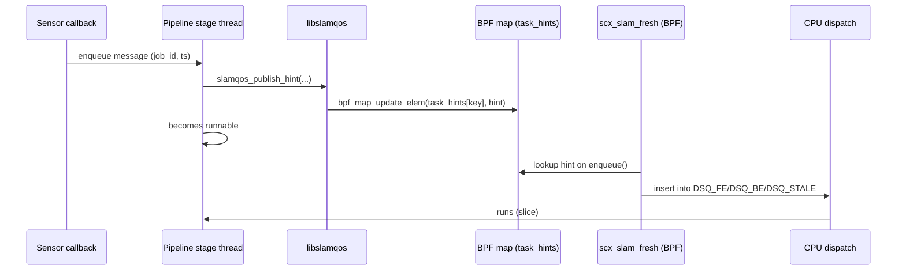

# DESIGN: Userspace hints API (libslamqos)

## Goal
Provide a **small, explicit API** for pipeline code to publish the scheduling metadata
that Linux can’t infer:

- “this work item is stale after 2 frames”
- “this job must complete before T”
- “this job should not burn more than X microseconds”
- “this is front-end vs back-end”

## Why a userspace API instead of kernel heuristics?
Because a robotics pipeline’s semantics live above the kernel:
only the application knows the freshness window and the meaning of a job id.

---

## Data flow (sequence)

---

## API surface

### `slamqos_open(pin_dir)`
- opens `task_hints` map pinned under `pin_dir`

### `slamqos_publish_hint(hint)`
Updates the map entry keyed by current thread’s pid/tgid.

### Recommended usage pattern
At the start of processing each message/work-item:
1) compute `deadline_ts` and `stale_ns`
2) set `job_id` (monotonic per stage/thread)
3) publish the hint
4) do work

---

## Hint fields and invariants

### Required
- `stage_id`
- `class` (FE/BE)
- `job_id` (must change for new work)
- `release_ts_ns` (CLOCK_MONOTONIC / steady_clock)
- `deadline_ts_ns` (>= release_ts_ns; 0 means “none”)
- `stale_ns` (0 means “never stale”, but for SLAM you usually want nonzero)

### Optional
- `budget_ns` (0 => no demotion)
- `slice_ns` (0 => scheduler default)
- `weight` (for BE fairness; 0 => default)

---

## What happens if you don’t publish hints?
- The scheduler falls back to BE behavior with a default slice.
- This matters because in partial switch mode you might have unrelated SCHED_EXT tasks.
