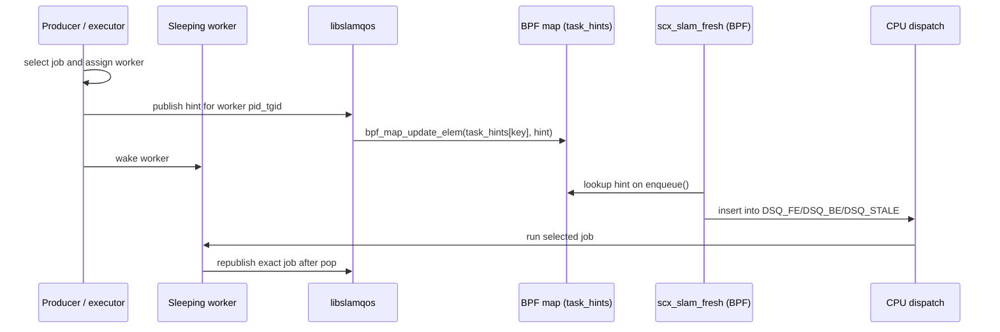

# DESIGN: Userspace hints API (libslamqos)

## Goal
Provide a **small, explicit API** for pipeline code to publish the scheduling metadata
that Linux can’t infer:

- “this work item is stale after 2 frames”
- “this job must complete before T”
- “this job should not burn more than X microseconds”
- “this is front-end vs back-end”

## Why a userspace API instead of kernel heuristics?
Because a robotics pipeline’s semantics live above the kernel:
only the application knows the freshness window and the meaning of a job id.

The ownership rule is:

> Userspace selects work. `sched_ext` consumes metadata about the work already
> selected for a worker.

A hint describes a worker that is about to run a specific job. It is not a
kernel-side copy of an application queue.

---

## Data flow (sequence)

---

## API surface

### `slamqos_open(pin_dir)`
- opens `task_hints` map pinned under `pin_dir`

### `slamqos_publish_hint(hint)`
Updates the map entry keyed by current thread’s pid/tgid.

### Recommended usage pattern
For a worker that is already running, at the start of each work item:
1) compute `deadline_ts` and `stale_ns`
2) set `job_id` (monotonic per stage/thread)
3) publish the hint
4) do work

Sleeping workers need the stronger executor contract below because publishing
after they run is too late to classify the wakeup.

---

## Executor contract

`task_hints` contains one slot per worker `pid_tgid`. Correctness therefore
depends on the executor serializing job ownership and hint publication.

### Assign, publish, wake

For a sleeping worker, perform these actions in order:

1. Select the job and bind it to a worker.
2. Publish `(worker pid_tgid, job_id, stage, class, release, deadline, stale,
   budget, slice)` into that worker's slot.
3. Wake the worker.

Never wake a worker while its slot still describes the previous job.

### Busy worker

When a worker selects another callback without sleeping, publish the new job
after selection and before compute begins. No intervening sleep is required:
the current execution is already running, and the new hint will be visible to
the next `stopping` / `enqueue` scheduling boundary.

### Protect in-flight work

A producer, stealing path, or eviction path must not overwrite a worker whose
current `job_id` is still executing. Only the worker may clear or replace the
slot at job end, unless the executor has independently established that the
worker finished.

### Steal, cancel, and evict

- Do not wake a victim for work it no longer owns.
- A thief publishes the stolen job onto its own worker before running it.
- Do not publish an item that is cancelled or evicted before execution.
- If an evicted head item was going to wake a worker, either publish the new
  head before waking that worker or do not wake it.

### Migration limitation

Contract version 1 supports stealing or migration only before a job starts
executing. Once a job enters compute, it remains on that worker until it
finishes, is cancelled by that worker, or is dropped by that worker.

Publishing the same `job_id` on another worker preserves identity but does not
transfer scheduler state. Today `exec_ns_in_job`, `overrun`, and the
`last_reported_*_job` fields are keyed by worker `pid_tgid`. Mid-job migration
would reset budget accounting and could grant a second FE pass. Supporting it
requires job-scoped state keyed by at least `(stage_id, job_id)`.

### Identity and timebase

- Keep `job_id` stable for one logical item across assignment or pre-start
  stealing. Assign a new id to new work.
- Use `CLOCK_MONOTONIC`, the userspace timebase corresponding to BPF
  `bpf_ktime_get_ns()`.
- Treat an unannotated `SCHED_EXT` worker as BE fallback behavior, not as a way
  to run front-end work.

### Current demo instance

The demo implements this contract for one FIFO consumer per queue. A producer
publishes the head item only when it will wake a sleeping consumer; the
consumer republishes the exact item after `pop()`. Producers do not overwrite
the hint while that consumer is busy.

### ROS 2 single-worker instance

`scx_slam_executor::FreshnessExecutor` implements the same ownership rule with
separate dispatcher and worker threads. The dispatcher selects one ready
`rclcpp::AnyExecutable` only after the worker has finished its previous job. It
then publishes the selected callback group's profile for that worker before
waking it. The worker does not steal or migrate work and clears its hint after
the callback returns or throws.

For ordinary callback groups, `release_ts_ns` is callback selection time. A
message-aware subscription registration changes the handoff: the dispatcher
takes one normal ROS message directly from DDS, extracts its `job_id` and
monotonic source timestamp, publishes that exact hint, and gives the same
message to the worker. It does not mirror DDS state in another queue. The v1
message path intentionally excludes serialized, dynamic, and intra-process
delivery.

---

## Hint fields and invariants

### Required
- `stage_id`
- `class` (FE/BE)
- `job_id` (must change for new work)
- `release_ts_ns` (CLOCK_MONOTONIC / steady_clock)
- `deadline_ts_ns` (>= release_ts_ns; 0 means “none”)
- `stale_ns` (0 means “never stale”, but for SLAM you usually want nonzero)

### Optional
- `budget_ns` (0 => no demotion)
- `slice_ns` (0 => scheduler default)
- `weight` (for BE fairness; 0 => default)

---

## What happens if you don’t publish hints?
- The scheduler falls back to BE behavior with a default slice.
- This matters because in partial switch mode you might have unrelated SCHED_EXT tasks.
