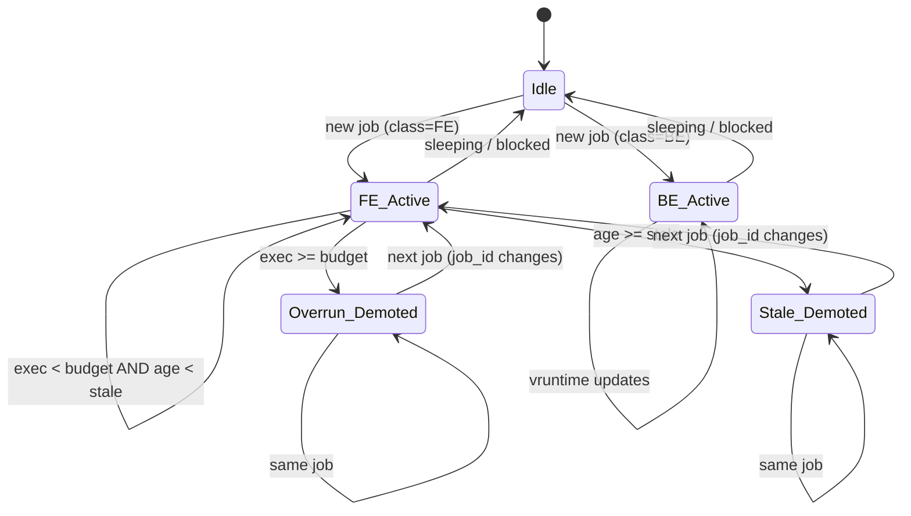

# DESIGN: Scheduling algorithm (Freshness + EDF + Budgets)

## TL;DR
- Front-end tasks use **effective deadlines** and run under EDF-like ordering.
- Back-end tasks are **best-effort** with vtime fairness.
- Tasks that overrun their compute budget are **demoted** for the remainder of the job.
- Tasks processing data older than their freshness window are **demoted**.

This is implemented using 3 custom DSQs and DSQ vtime ordering.

---

## Definitions

### Inputs (from userspace)
For each runnable task `p`, userspace provides `hint(p)`:

- `class`: FE or BE
- `job_id`: identifies current work item
- `release_ts`: job release time
- `deadline_ts`: absolute deadline
- `stale_ns`: freshness window
- `budget_ns`: compute budget for this job
- `slice_ns`: requested slice

### Scheduler-maintained state
For each task `p`, we keep:

- `exec_ns_in_job`: accumulated CPU time for current job
- `vruntime`: fairness accumulator for BE
- `last_start_ns`: timestamp when `p` started running last
- `overrun`: flag (set when exec exceeds budget for a job)

---

## Effective deadline and freshness
We treat freshness as a hard preference:
- If `(now - release_ts) > stale_ns` ⇒ demote to DSQ_STALE.

Otherwise front-end ordering uses:

`effective_deadline = min(deadline_ts, release_ts + stale_ns)`

This ensures that even if a job has a long deadline, it won’t be scheduled ahead of newer work once it starts to become stale.

---

## DSQ mapping
- FE & not stale & not overrun ⇒ DSQ_FE with vtime = effective_deadline
- BE or overrun ⇒ DSQ_BE with vtime = vruntime
- stale ⇒ DSQ_STALE with vtime = vruntime (or now)

---

## Dispatch policy
In `dispatch(cpu, prev)` we repeatedly fill dispatch slots:

1. try DSQ_FE
2. else DSQ_BE
3. else DSQ_STALE

---

## Budget enforcement
In `stopping(p, runnable)`:

- `delta = now - last_start_ns`
- `exec_ns_in_job += delta`

If `exec_ns_in_job > budget_ns` and `budget_ns != 0`, set `overrun=1` and emit an event.

Then on the next `enqueue` for this task/job we demote it to DSQ_BE.

---

## State machine


---

## Pseudocode (enqueue)
```text
on enqueue(task p):
    now = scx_now()

    st = state[p] (create if absent)
    h  = hint[p] (may be absent)

    if h.job_id != st.last_job_id:
        st.exec_ns_in_job = 0
        st.overrun = 0
        st.last_job_id = h.job_id

    if h.stale_ns != 0 and now - h.release_ts > h.stale_ns:
        class = STALE
    else if h.class == FE and !st.overrun:
        class = FE
    else:
        class = BE

    if class == FE:
        vtime = min(h.deadline_ts, h.release_ts + h.stale_ns)
        dsq_insert_vtime(DSQ_FE, vtime, slice=h.slice_ns)
    else if class == BE:
        vtime = st.vruntime
        dsq_insert_vtime(DSQ_BE, vtime, slice=h.slice_ns_or_default)
    else:
        dsq_insert_vtime(DSQ_STALE, st.vruntime, slice=small)
```

---

## Compatibility notes
Several sched_ext kfuncs were renamed across kernel versions (with aliases that later disappear).
This repo uses a weak-kfunc + `bpf_ksym_exists()` compatibility layer so one BPF object can run
across those renames.
