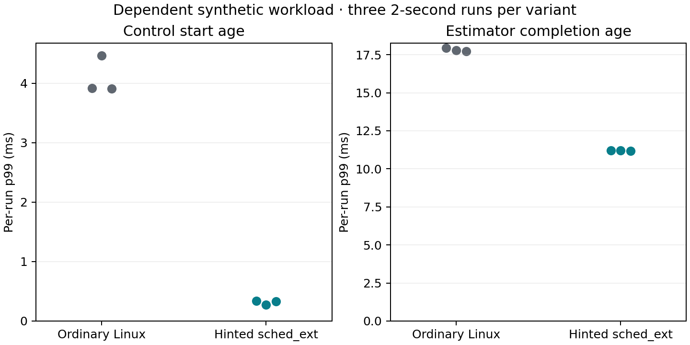

# Dependent workload comparison

On September 9, 2026, the dependent-v1 synthetic workload ran three times under
ordinary Linux scheduling, then three times under hinted sched_ext. Each run
offered 400 IMU measurements, 40 camera measurements and 200 control ticks over
two seconds. Workers shared CPU 14; the dispatcher used CPU 1. Two Background
workers repeatedly executed finite 1 ms jobs. These are dispatcher-fed jobs,
not continuously runnable hogs.

The kernel was 7.0.0-31-generic. Hinted runs used partial-switch mode, a 2 ms
Background insertion cap and a 2 ms / 10 ms Background server. Control was Urgent;
sensor processing and estimation were Deadline; mapping and background workers
were Background. No per-job budgets were requested. Both variants used the same
workload binary and synthetic compute rules. This compares the complete hinted
configuration, not the contribution of an individual scheduler mechanism.

## Results

Ranges below are the minimum and maximum of three per-run p99 values, not a
pooled percentile or a confidence interval.

The [measurement archive](https://github.com/seldak/scx-slam-fresh/releases/tag/dependent-eval-2026-09-09)
contains per-run metrics, job traces, loader logs and build provenance.
Application revision: `6572aae`; scheduler revision: `1aa9ac8`.



| Metric | Ordinary Linux | Hinted sched_ext |
| --- | --- | --- |
| Control p99 start age | 3.91–4.47 ms | 0.27–0.34 ms |
| Control p99 completion age | 4.11–4.67 ms | 0.48–0.54 ms |
| Estimator p99 completion age | 17.71–17.94 ms | 11.17–11.22 ms |
| Mapping p99 completion age | 24.33–25.08 ms | 19.14–19.83 ms |
| IMU late / completed | 12 / 1200 | 0 / 1200 |
| Control late / completed | 0 / 600 | 0 / 600 |
| Estimator batches completed | 1315 | 1320 |
| Estimator thread CPU total | 755.98 ms | 757.49 ms |
| Background jobs completed, combined | 4139 | 4172 |

All source measurements were consumed; there were no drops or unfinished jobs.
Each run had one initial control tick without an estimate and 199 eligible
snapshot selections. Neither variant selected a stale snapshot. Control p99
retained-IMU age at selection ranged from 10.16–15.07 ms under ordinary Linux
and 5.32–5.36 ms under hinted scheduling. Snapshot eligibility is a synthetic
age rule, not estimator confidence or a control-stability result.

## Interpretation and limits

The hinted configuration reduced control dispatch latency on this workload.
Both configurations nevertheless met all control callback deadlines. This is
latency headroom evidence, not evidence that control failed without sched_ext.

Arrival-dependent batching changed computation: five additional hinted estimator
batches added 1.5 ms of configured overhead, consistent with the measured 1.51 ms
CPU difference. Batching and CPU ordering both affect downstream timing.
CPU totals include the separately reported drain after source releases end.

The runs are short and ordered by variant; they do not characterize long-run
tails, thermal effects or statistical significance. Background throughput was
similar in these runs; this does not establish zero scheduler overhead. No FIFO,
SCHED_DEADLINE, other sched_ext policy, real estimator or embedded target was
compared. An earlier isolated IMU interruption remains unexplained; its absence
here is not proof of a fix.

## Reproduce

Check out application `6572aae` and scheduler `1aa9ac8`, build, then run:

```bash
make
make test-graph
sudo python3 scripts/test_dependent_loaded.py --cpu 14 --housekeeping-cpu 1
```

The runner records hashes, logs and job CSVs for all six runs. Compare source
counts and estimator CPU work before interpreting latency differences. See
[the workload profile](../USAGE.md#dependent-threaded-workload) for the exact
activation, compute, queue and timing rules.

To regenerate the figure, install Matplotlib and pass the extracted archive's
summary to `python3 scripts/plot_dependent_results.py summary.csv figure.png`.
The same command accepts a new run's summary. Timing values will vary between runs.
